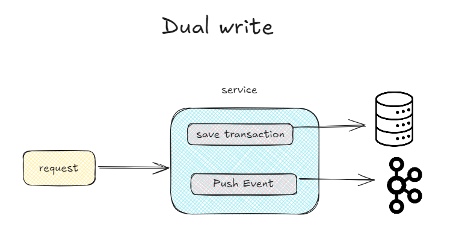
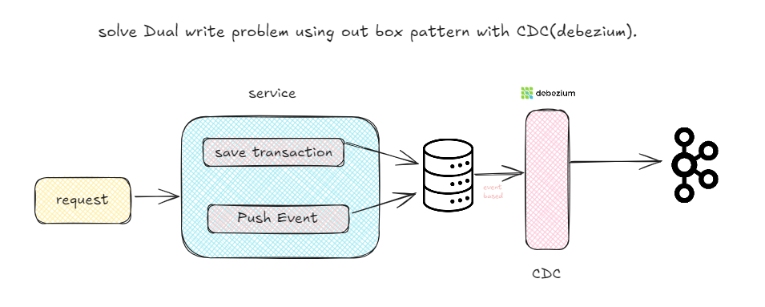
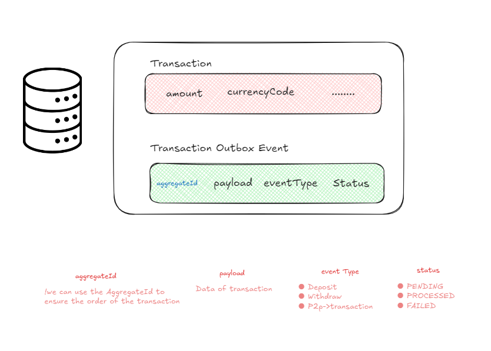

# Outbox Pattern Implementation for Dual Write Problem in Event-Driven Architecture

This repository demonstrates the implementation of the Outbox Pattern to address the dual write problem in an event-driven architecture. The service ensures data consistency by storing records in a PostgreSQL database and reliably pushing corresponding events to Kafka logs using Debezium.

## Technologies Used

- **Java & Spring framework**: The core programming language used for developing the service.
- **PostgreSQL**: database
- **Debezium**: A distributed platform that captures changes from the PostgreSQL database and publishes them to Kafka.
- **Kafka**: A distributed streaming platform used to handle the event logs.

## Features

- **Outbox Pattern Implementation**: Guarantees consistency between the database and event logs by using a transactional outbox table.
- **Event-Driven Architecture**: Leverages Kafka for asynchronous message passing and event logging.
- **Debezium Integration**: Captures changes from the PostgreSQL database and streams them to Kafka.
- **Reliable Data Synchronization**: Ensures that no events are lost, even in the case of service failures.
-------

----------
##### database 
## 